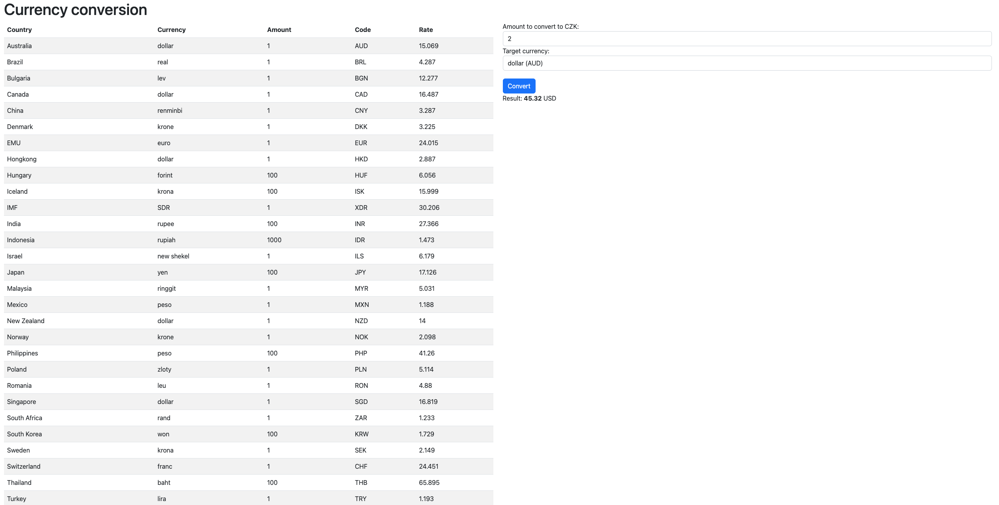

# Simple Conversion App

Covers basic implementation for showing currencies from API and conversion to the target amount.



# Local environment

```
pnpm install
npm run server
```

Open http://localhost:5173

# Possible improvements

- tests
    - cypress tests to test the page behaviour against mocks
    - e2e tests between FE/BE and 3rd party API
    - integration tests between FE/BE
    - integration tests for BE API
- deployment to heroku (maybe via Docker)
- environment configuration for backend and front-end, so we can deploy and manage multiple environments (API Urls,
  secrets, etc.)
- improve design
- don't use **floats** for any calculation connected to amounts - use Integers
- add currency sign
- improve select design
- use `nx` to split project into client/server and common parts (like interfaces)


# Tech stack

- vite, vitest, typescript, react, react query, styled components, express 